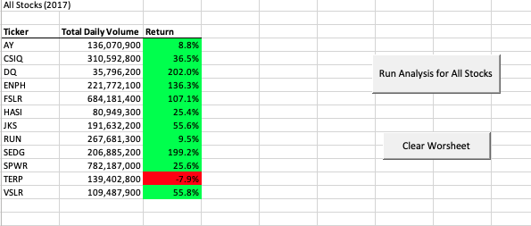
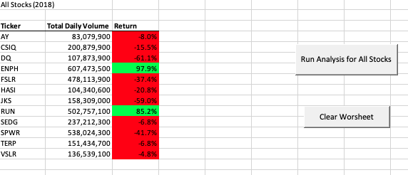
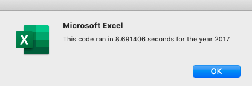
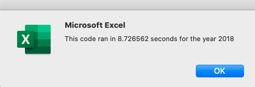

## stock-analysis Module 2 VBA

##### Deliverable 2 Written Analysis of Results

**Overview of Project**

This week, we use the Visual Basic for Applications (VBA) programming language in Microsoft Office to analyze real stock market data. To execute this task, we learn core coding concepts to perform both simple and complex analyses. Some scripts we use in this Module include triggering pop-ups, changing cell values, using for and nested for loops. We want to be able to reuse this code on many different stocks and multiple stocks at a time.

**Results**
 
 
 

By comparing the two charts for all Stocks in 2017 and 2018, we can clearly see that stocks  were doing significantly better in 2017. TERP was the only stock that fell that year, while in 2018 there were only two stocks that returned positive. 
 
  
  

Both my 2017 and 2018 spreadsheets took almost 9 seconds to run.

**Summary**

Refactoring code allows us to improve the design of our Software, make it easier to understand, help us find bugs, and program faster. Disadvantages are that is can be risky when the application is big. Specifically, in VBA script, refactoring will help make the code more readable and hopefully run faster. Some downsides to refactoring include the time it takes to refactor and the possibility of making mistakes and creating more problems than solutions.

